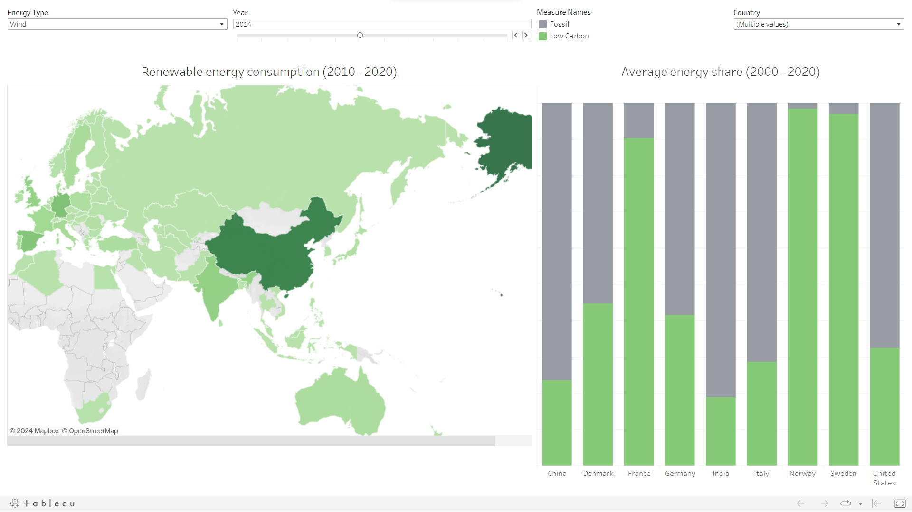

# Global Energy Dashboard

## Overview
This project involves a comprehensive analysis and visualization of global energy data. The objective is to uncover insights into energy production and consumption patterns across different countries and over various time periods. 

## Data Source
The dataset used in this project was obtained from [Our World in Data](https://ourworldindata.org). This rich dataset offers extensive information on various aspects of global energy use, including production, consumption, and different energy sources.

## Methodology
The project was executed in three main steps:

1. **Data Acquisition**: The dataset was directly downloaded from the [Our World in Data website](https://ourworldindata.org/energy). No data cleaning was required as the dataset was already in a comprehensive and useable format.

2. **Data Exploration with SQL**: In-depth exploration of the dataset was conducted using SQL queries. These queries were designed to extract meaningful insights about energy production and consumption patterns. Key aspects analyzed included total energy production by country, annual coal consumption, per capita oil consumption, and yearly nuclear energy production.

3. **Dashboard Creation in Tableau Public**: Select findings from the SQL queries were then visualized using Tableau Public. The dashboard created offers an interactive and user-friendly interface for exploring these complex datasets. It provides a clear and concise visual representation of the key insights derived from the data.

  <em>Image: Interactive dashboard visualizing global energy data.</em>

## Project Outcome
The final outcome is an [interactive dashboard](https://public.tableau.com/app/profile/luca.fuligni/viz/EnergyDashboard_17038595133430/Dashboard1) hosted on Tableau Public, allowing users to explore various facets of global energy data. This visualization makes it easy to understand complex patterns and trends in energy production and consumption across different countries and time periods.
